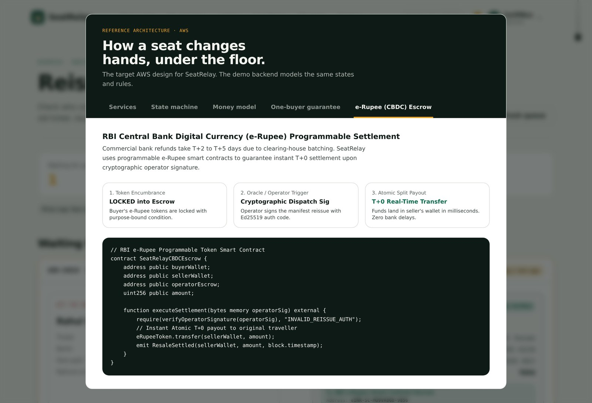
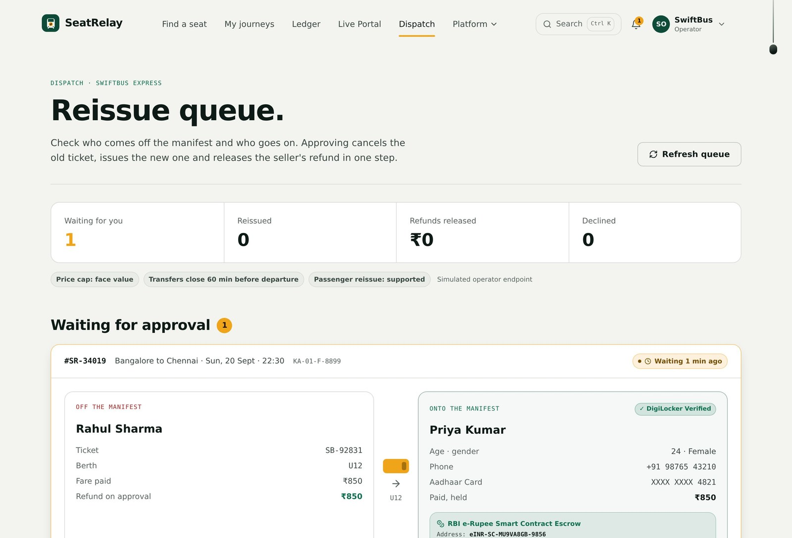
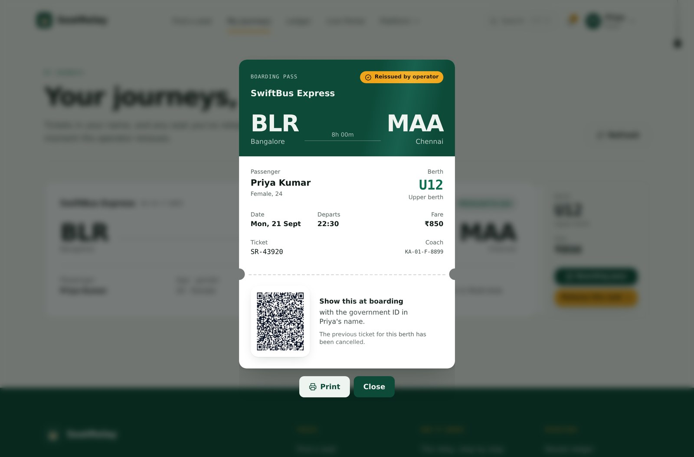

<div align="center">


# SeatRelay

### Operator-authorised bus seat resale, at exact face value.

*Your seat doesn't have to go to waste.*

[](https://d3ae1u9o1bbuui.cloudfront.net/)
[](https://wemakedevs.org)
[](#programmable-money-rbi-e-rupee-escrow)
[](cloudformation/seatrelay-serverless.yml)

### **[▶ Open the live demo](https://d3ae1u9o1bbuui.cloudfront.net/)**

[Architecture](#architecture) · [Correctness](#the-one-buyer-guarantee) · [e-Rupee settlement](#programmable-money-rbi-e-rupee-escrow) · [Deploy it yourself](DEPLOY_AWS.md)

</div>

<div align="center">
  
</div>

---

## The problem, in one paragraph

A traveller books a bus seat. Plans change. Inside the operator's no-refund window, cancelling returns **₹0** — the entire fare is gone. At that same moment, someone searching that exact route sees **Sold Out**, and the coach departs with an empty berth. The obvious fix — handing your ticket to a stranger — is not available: tickets carry the original passenger's name, and boarding requires a matching government photo ID. So the berth runs empty, or it gets filled off-manifest for cash paid to the crew, which is the safety problem no operator can accept.

**SeatRelay moves the transfer to the operator level** — the only place it can legitimately happen. The seller releases the berth; a buyer on the same route claims it at the printed fare; the operator cancels the original ticket and issues an authentic one in the buyer's name, against DigiLocker-verified identity. Settlement is atomic with the reissue.

| | Today | With SeatRelay |
|---|---|---|
| **Seller recovers** | ₹0 — total loss | **₹850** — full fare, settled T+0 |
| **Buyer pays** | Cannot travel — sold out | **₹850** — exact face value, never more |
| **Operator gets** | Empty berth, no-show | Paid seat **+ accurate manifest** |

Platform and operator fees come out of money the seller would otherwise have lost entirely — never added on top of the buyer's price. Zero scalping is a property of the system, not a policy we promise to enforce.

> **Precedent:** Indian Railways already permits confirmed-ticket transfer — but only to immediate family, 24+ hours ahead, at a physical counter. SeatRelay is that same idea as a digital protocol: between strangers, online, up to 60 minutes before departure.

---

## Architecture

Deployed today on AWS, fronted by CloudFront over HTTPS:

```
                    ┌──────────────────┐
   Browser ─HTTPS──►│ Amazon CloudFront│  managed TLS, edge cache
                    └────────┬─────────┘
                             │ origin
          ┌──────────────────▼──────────────────────────────┐
          │  Amazon EC2 · t3.micro · Amazon Linux 2023      │
          │                                                  │
          │   nginx :80                                      │
          │     ├── /            React 18 + TS + Tailwind    │
          │     └── /api  ─────► Node.js 22 + Express :4000  │
          │                        ├── transfer state machine│
          │                        ├── e-Rupee escrow engine │
          │                        ├── DigiLocker e-KYC      │
          │                        ├── QR boarding passes    │
          │                        └── SQLite (WAL) ─► EBS   │
          └──────────────────────────────────────────────────┘
             provisioned by cloud-init user data · systemd-managed
```

**Security posture:** port 80 is the only ingress; SSH is IP-restricted; the API on 4000 is never exposed — it is reachable only on the internal Docker network. Identity numbers are masked at the API boundary, not in the UI.

**Reproducibility:** no step of this was configured by hand. [`deploy/ec2-user-data.sh`](deploy/ec2-user-data.sh) installs the runtime, clones, builds, and registers a systemd unit so the stack survives a reboot. Paste it into *Advanced details → User data* and you get this deployment.

### Scaling path — [`cloudformation/seatrelay-serverless.yml`](cloudformation/seatrelay-serverless.yml)

The single-instance deployment is a deliberate choice, not a limitation we discovered late. Every component was written so it relocates rather than gets rewritten — and the target stack is defined as infrastructure-as-code, 515 lines of CloudFormation covering:

| Layer | Deployed today | Defined in the IaC template |
|---|---|---|
| Edge / TLS | **Amazon CloudFront** | CloudFront + S3 static origin |
| Compute | Express on **EC2** | **Lambda** (`ClaimSeat`, `ExpireListing`) behind **API Gateway** |
| Identity | JWT + PBKDF2 | **Cognito** user pool, groups `seller` / `buyer` / `operator` |
| Data | SQLite WAL on **EBS** | **DynamoDB** — `Listings`, `OperatorTickets`, `Transfers`, `CBDCEscrowContracts` |
| Orchestration | In-process state machine | **Step Functions** with operator task tokens |
| Notifications | In-app feed | **Amazon SNS** topic per transition |
| Objects | Generated in-process | **S3** bucket for passes and receipts |
| Observability | Structured logs | **CloudWatch** dashboard |

The claim guard becomes a DynamoDB `ConditionExpression`; the state machine becomes an ASL definition. **The business logic does not change — only where it runs.**

---

## The one-buyer guarantee

Two buyers clicking *claim* in the same millisecond is the correctness problem at the heart of resale. Sell one berth twice and you have taken two payments and created a boarding dispute at 22:30 on a highway.

Read-then-write leaves a window. So the check *is* the write:

```sql
UPDATE resale_listings
   SET status = 'CLAIMED', buyerId = :buyer, claimExpiresAt = :timeout
 WHERE id = :id
   AND status = 'LISTED';   -- ← the guard
```

Exactly one statement affects a row. The database arbitrates, not application code. The loser receives `409 Conflict: "Seat already claimed"` — a correct answer, not an error. The same guard is a DynamoDB `ConditionExpression`, which is why the migration above is a relocation.

### Transfer state machine

```
             withdraw
   LISTED ─────────────► WITHDRAWN
     │  ▲
claim│  │ payment window timeout (10m)
     ▼  │ or operator reject before cutoff
  CLAIMED ──pay──► PAYMENT_HELD ──► REISSUE_PENDING ──approve──► REISSUED ──► SETTLED
     │                                      │
     │                                      └─reject──► buyer decumbered ──► EXPIRED
     └── cutoff reached (T-60m) ──► EXPIRED
```

| Failure | Handling |
|---|---|
| Payment window expires (10 min) | Claim released, berth returns to `LISTED` |
| Operator rejects | Tokens decumbered to buyer immediately; berth relists if before cutoff |
| Cutoff reached (T-60 min) | Listing expires, hold lifted, seller falls back to operator policy |
| Seller withdraws | Permitted any time before a buyer pays |

Every path is implemented. The seller is **never worse off than doing nothing**, which is what makes releasing a berth a rational default rather than a gamble.

---

## Programmable money: RBI e-Rupee escrow

A resale is only fair if the seller is actually paid. Commercial-bank refunds take **T+2 to T+5** because of clearing-house batching — precisely the friction that makes travellers give up and absorb the loss.

<div align="center">
  
</div>

[`backend/src/cbdc.service.js`](backend/src/cbdc.service.js) models the RBI/NPCI purpose-bound token specification:

| Stage | Mechanism |
|---|---|
| **1 · Encumbrance** | Buyer's e-Rupee tokens lock into a contract carrying the condition `operator_authorized_reissue == true`. The money belongs to neither party while it waits — it is programmatically inert, not a card hold or a platform float. |
| **2 · Oracle trigger** | No third-party oracle is needed. The operator is already the only entity that can legitimately void and reissue a ticket, so **their reissue signature releases the condition**. The authority that performs the action releases the money, in the same step. |
| **3 · Atomic split** | Seller, operator and platform settle in one indivisible transaction at **T+0**. There is no window in which the berth has moved but the seller is unpaid. Rejection decumbers straight back to the buyer. |

Each contract records wallet addresses, token serial numbers, the encumbrance condition, and a settlement hash — inspectable at `GET /api/cbdc/contracts`.

---

## The transfer, as the operator sees it

<div align="center">
  
</div>

One screen, one decision: who comes **off** the manifest, who goes **on**. Identity is DigiLocker-verified before the request is queued, Aadhaar is masked to the last four digits, and the locked escrow contract address is shown inline. Approving cancels the old ticket, issues the new one, and releases settlement as a single operation.

<div align="center">
  
</div>

The buyer receives an authentic boarding pass in their own name, with a fresh signed QR. The previous ticket is void at the gate. **Everyone on board is on the manifest** — which is the entire point.

---

## Run it

### Docker — matches production

```bash
docker compose up -d --build
```

App on `http://localhost`, API proxied at `/api`. Seeded on first start; data persists in the `seatrelay_data` volume.

### Local development

```bash
cd backend  && NODE_PATH=../frontend/node_modules node src/server.js   # :4000
cd frontend && npm install && npx vite --host 0.0.0.0 --port 5173      # :5173
```

The demo fleet always departs **tonight** — `serviceDay()` in `backend/src/seed.js` rolls forward if seeded inside the cutoff window, so the walkthrough works on any day it is run.

### Deploy to AWS

Launch a `t3.micro` on Amazon Linux 2023, paste [`deploy/ec2-user-data.sh`](deploy/ec2-user-data.sh) into **Advanced details → User data**, open port 80. Full walkthrough, security-group rules, Free Tier cost breakdown and teardown: **[DEPLOY_AWS.md](DEPLOY_AWS.md)**.

---

## Try the full flow in 60 seconds

One-tap demo accounts — no passwords to type.

| Account | Role | Do this |
|---|---|---|
| **Rahul** | Seller | *My journeys* → **Release this seat**. Refund preview: cancel now ₹0, release ₹850. |
| **Priya** | Buyer | *Find a seat* → Bangalore → Chennai. The sold-out 22:30 coach shows **1 relayed berth** at ₹850. Pay with e-Rupee. |
| **SwiftBus** | Operator | *Dispatch* → compare manifests → **Approve reissue**. Escrow settles T+0; new QR issues. |

`Ctrl K` opens the command palette · *Reset demo data* lives in the account menu · pull the cord (top right) for dark mode.

Automated: `curl -X POST <host>/demo/run-full-flow` executes the entire transfer end to end.

---

## Engineering scope

| ✅ Built and working | 🔶 Simulated, and labelled as such |
|---|---|
| Live AWS deployment behind CloudFront HTTPS | Operator reservation system (`MockOperatorService` + console) |
| Transfer state machine with every rollback path | e-Rupee settlement — models the RBI/NPCI spec, not wired to a live CBDC pilot |
| Atomic single-buyer claims, payment timeouts, cutoff expiry | DigiLocker Aadhaar e-KYC (sandbox; demo OTP `123456`) |
| Programmable escrow: encumbrance, split payout, rollback | Carrier manifest GDS webhooks |
| QR boarding-pass generation and operator reissue | |
| CloudFormation definition of the serverless target stack | |
| JWT auth, PBKDF2 hashing, masked identity at the API boundary | |

Scoping honestly is a design decision. Every simulated component sits behind an interface that a real integration drops into.

---

## Project layout

```
backend/
  src/workflow.js        transfer state machine, guards and rollbacks
  src/cbdc.service.js    RBI e-Rupee programmable escrow engine
  src/server.js          REST API — listings, claims, checkout, dispatch
  src/seed.js            demo fleet, always departing tonight
frontend/
  src/components/        search · journeys · dispatch · ledger · live portal
cloudformation/
  seatrelay-serverless.yml   Cognito · DynamoDB · Lambda · Step Functions · SNS · S3
deploy/                  EC2 bootstrap and redeploy scripts
DEPLOY_AWS.md            AWS deployment guide
```

---

## Team

| Member | Owned |
|---|---|
| **Hirthik Balaji** | Team lead · resale protocol design, transfer state machine, REST API, e-Rupee settlement engine, React application, CloudFormation stack definition |
| **Jyothir** | Product and UX definition, design system, demo data scheduling, EC2 build hardening |
| **Lakshya Sasikumar** | AWS deployment — EC2, CloudFront, security groups, cloud-init bootstrap, release integration and deployment documentation |
| **[Member 4]** | *(role)* |

Built over three days for **First Commit** — Bharat Builds Tour, WeMakeDevs × AWS, September 2026. Development was assisted by AI coding tools (Google Antigravity and Claude Code) for implementation and documentation support; architecture, protocol design and all product decisions are the team's own.

---

<div align="center">

### Nobody loses the fare. Nobody misses the bus. Everyone on board is on the record.

**[Open the live demo →](https://d3ae1u9o1bbuui.cloudfront.net/)**

</div>
