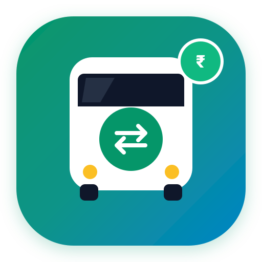
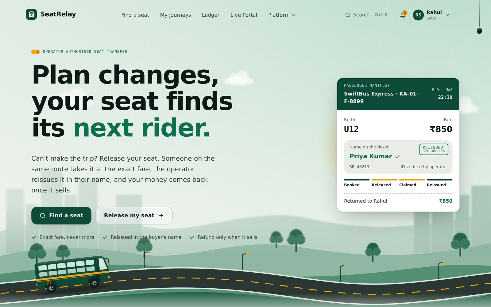
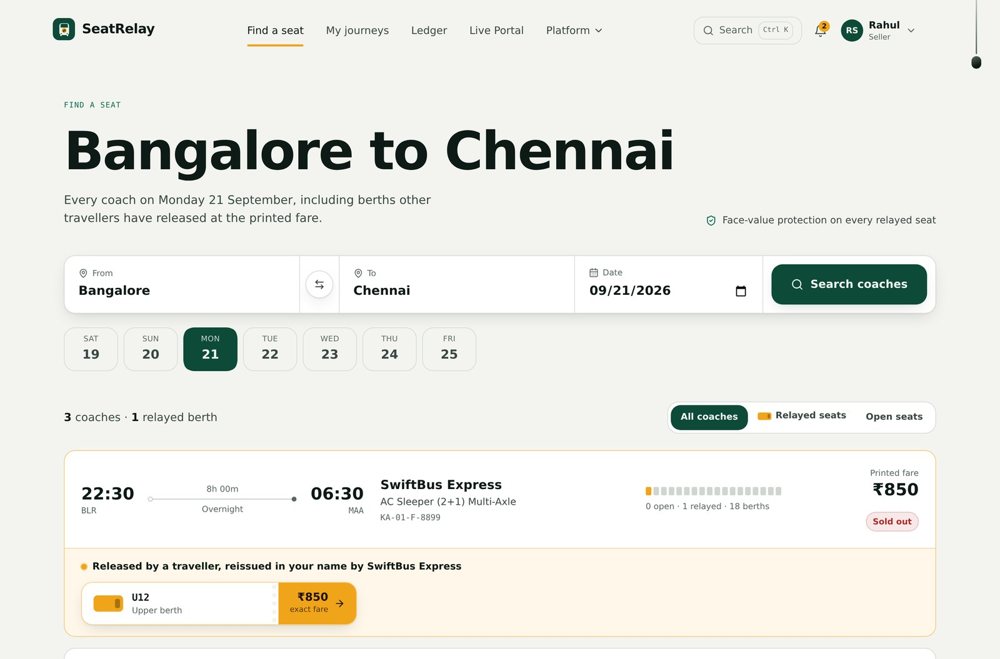
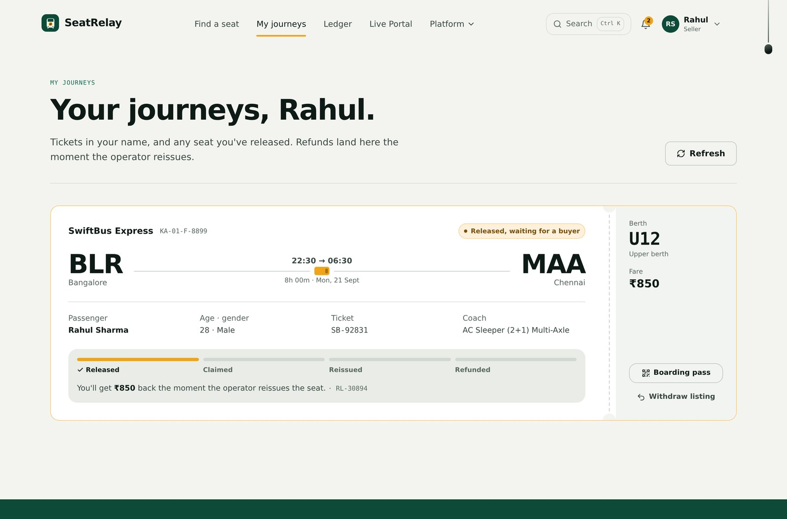
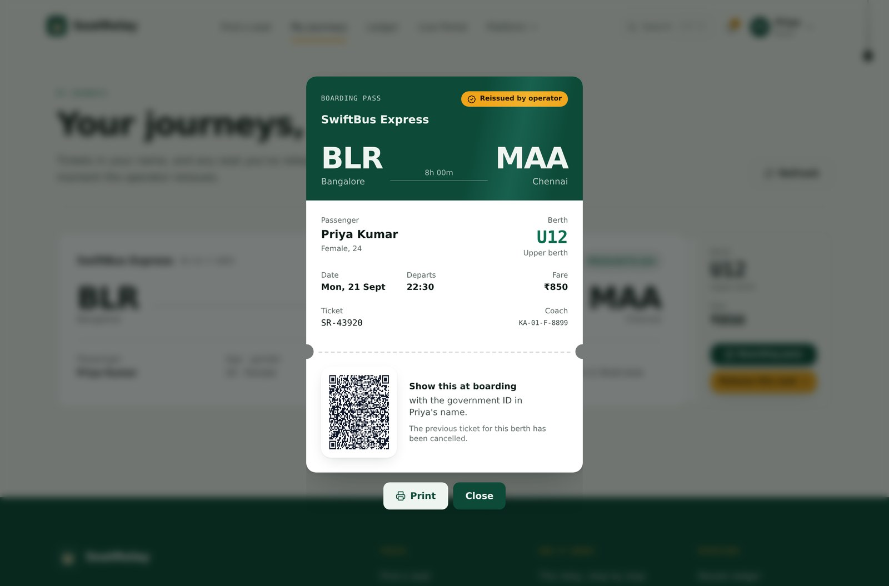
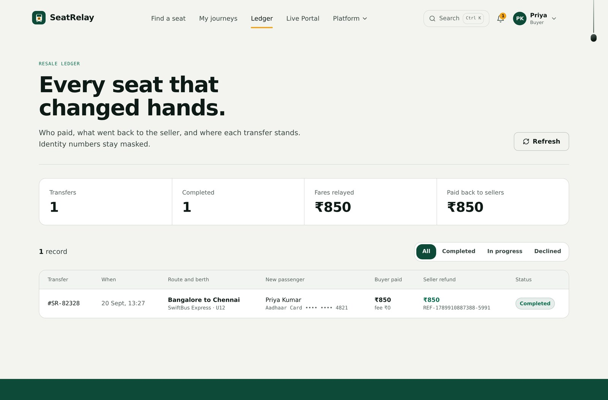
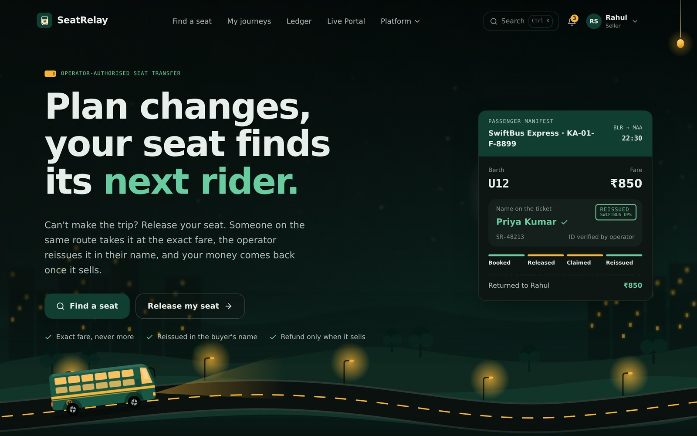

<div align="center">



# SeatRelay

### Operator-authorised bus seat resale, at exact face value.

*Your seat doesn't have to go to waste.*

[](https://wemakedevs.org)
[](https://d3ae1u9o1bbuui.cloudfront.net/)
[](#-money-that-moves-in-milliseconds-rbi-e-rupee-escrow)
[](https://react.dev)
[](https://nodejs.org)

**[Live Demo (HTTPS)](https://d3ae1u9o1bbuui.cloudfront.net/) · [Watch the 3-minute walkthrough](#-demo-video) · [Deploy it yourself](DEPLOY_AWS.md)**

</div>

<div align="center">
  
</div>

---

## The 30-second version

A traveller books a bus seat. Plans change. Inside the operator's no-refund window, cancelling returns **₹0** — the entire fare is lost. Meanwhile someone searching that exact route sees **Sold Out**, and the coach departs with an empty berth.

The obvious fix — *"just give your ticket to someone else"* — doesn't work: tickets carry the original passenger's name, and boarding requires a matching government photo ID.

**SeatRelay makes the transfer happen at the operator level**, the only place it can legitimately happen. The seller releases the berth, a buyer on the same route claims it at the printed fare, and the operator cancels the old ticket and reissues an authentic one in the buyer's name. The seller's money is released the instant the operator signs.

| | Today | With SeatRelay |
|---|---|---|
| **Seller recovers** | ₹0 (100% loss) | **₹850** — full fare, settled T+0 |
| **Buyer pays** | Can't travel — sold out | **₹850** — exact face value, never more |
| **Operator gets** | Empty seat, no-show | Paid seat + **accurate manifest** |

Fees come out of money the seller would otherwise have lost entirely — never added on top of the buyer's price.

---

## 📽 Demo video

> **▶️ [Watch the 3-minute walkthrough](#)** 

<!--
  To embed: drag your recording into a GitHub issue to get a user-images URL,
  then replace the line above with the bare URL on its own line:

  https://github.com/user-attachments/assets/<id>

  GitHub renders that as an inline player. For YouTube, use a linked thumbnail:
  [](https://youtu.be/<id>)

  `scripts/record_demo_video.js` automates a 1080p capture of the full flow.
-->

---

## How it works

```
   SELLER                    BUYER                   OPERATOR
     │                         │                         │
     │ releases berth U12      │                         │
     ├────────────────────────►│ sees 1 relayed berth    │
     │   LISTED                │ at ₹850 (face value)    │
     │                         │                         │
     │                         ├── pays ₹850 ───────────►│ reissue request
     │                         │   e-Rupee LOCKED        │ + DigiLocker e-KYC
     │                         │   purpose-bound         │
     │                         │                         │
     │                         │        ┌────────────────┤ signs the reissue
     │◄── ₹850, T+0 ───────────┼────────┘  REISSUED      │ old ticket cancelled
     │    atomic split          │◄─ new QR boarding pass ─┤ new ticket issued
     │                         │    in Priya's name      │
```

Every transition is guarded. A seat can be claimed exactly once, funds stay encumbered until the operator acts, and unsold berths auto-expire 60 minutes before departure with the seller falling back to the operator's normal policy — **never worse off than today**.

---

## See it

### Find a seat — sold-out coach, one relayed berth at the printed fare


### Seller releases a berth — refund preview before committing


### Operator dispatch — who comes off the manifest, who goes on


Identity numbers stay masked. The buyer's Aadhaar is verified through DigiLocker e-KYC before the request reaches the operator, and the locked e-Rupee contract address is shown inline.

### Reissued boarding pass — new name, new QR, old ticket void


### Ledger — every transfer, what the buyer paid, what went back


### Light and dark, because demos happen in dim rooms


---

## 💸 Money that moves in milliseconds: RBI e-Rupee escrow

A resale is only fair if the seller is actually paid. Commercial-bank refunds take **T+2 to T+5** days because of clearing-house batching — which is exactly the friction that makes people give up and eat the loss today.

SeatRelay settles over **RBI e-Rupee (CBDC) programmable tokens** instead:


| Stage | What happens |
|---|---|
| **1. Token encumbrance** | The buyer's e-Rupee tokens are locked into a smart contract, purpose-bound with the condition `operator_authorized_reissue == true`. The money is neither the buyer's nor the seller's while it waits. |
| **2. Operator signature** | The operator's approval *is* the oracle trigger — the manifest reissue is signed, and the signature releases the condition. |
| **3. Atomic split payout** | Seller, operator and platform are paid in one indivisible transaction, **T+0**, in milliseconds. A rejection instead decumbers the tokens straight back to the buyer. |

Implementation: [`backend/src/cbdc.service.js`](backend/src/cbdc.service.js) models the RBI/NPCI programmable-token spec — wallets, token serial numbers, encumbrance conditions, settlement hashes, and instant rollback. Browse live contracts at `GET /api/cbdc/contracts`, or in the app under **Platform → Reference architecture → e-Rupee (CBDC) Escrow**.

---

## Why an open resale forum can't do this

| Problem | What breaks |
|---|---|
| **Name on the ticket** | Money changes hands but the ticket still says the seller's name. The buyer is turned away at boarding, or travels under a false identity. |
| **No fraud protection** | The seller can still cancel and take the refund, or sell the same berth twice. Only the operator can void the original ticket. |
| **Scalping** | Third-party markups inflate prices above face value exactly when demand peaks. |

**The insight:** the transfer must be executed *by the operator*, because only the operator can cancel the old ticket and issue an authentic one. SeatRelay is the protocol layer that makes that routine.

### Precedent
Indian Railways permits confirmed-ticket transfer — but only to immediate family, 24+ hours ahead, at a physical counter. SeatRelay is the same idea as an authorised digital protocol: **between strangers, online, up to 60 minutes before departure.**

---

## Architecture

The hackathon build runs as **two containers on a single AWS EC2 Free Tier instance**. Nginx serves the React bundle and reverse-proxies the API, so only port 80 is exposed.

```
                    ┌─────────────── EC2 t3.micro (Free Tier) ───────────────┐
   Browser  ──:80──►│  nginx                                                  │
                    │    ├── /            React 18 + TypeScript + Tailwind    │
                    │    └── /api  ──────► Node.js + Express                  │
                    │                        ├── resale workflow engine       │
                    │                        ├── e-Rupee escrow service       │
                    │                        ├── DigiLocker e-KYC (sandbox)   │
                    │                        ├── QR boarding passes           │
                    │                        └── SQLite (WAL) ── volume       │
                    └─────────────────────────────────────────────────────────┘
```

One box, one `docker compose up`, no managed services to configure — which is what makes it reproducible by a judge in five minutes. Instance sizing, security-group rules and the bootstrap script are in **[DEPLOY_AWS.md](DEPLOY_AWS.md)**.

### Target production architecture

The workflow engine in `backend/src/workflow.js` is written as an explicit state machine so it maps directly onto managed AWS services as traffic grows:

| Component | Hackathon build | Production target |
|---|---|---|
| Frontend hosting | nginx on EC2 | **AWS Amplify Hosting** |
| API | Express on EC2 | **API Gateway + Lambda** |
| Auth | JWT + PBKDF2 | **Amazon Cognito** (`seller` / `buyer` / `operator` groups) |
| Data | SQLite (WAL) | **DynamoDB** with conditional writes |
| Transfer orchestration | In-process state machine | **Step Functions** with operator task tokens |
| Cutoff expiry | Timestamp checks | **EventBridge Scheduler**, one schedule per listing |
| Notifications | In-app | **Amazon SNS** |
| Boarding passes | Generated in-process | **S3** + CloudFront |

The state transitions, the one-buyer guarantee and the rollback paths are all implemented today — the table describes where each one *runs*, not whether it exists. Open **Platform → Reference architecture** in the app (or `Ctrl K`) to see it rendered.

### The one-buyer guarantee

Two buyers clicking "claim" in the same millisecond is the correctness problem at the heart of resale. The claim is a conditional write:

```sql
UPDATE resale_listings
   SET status = 'CLAIMED', buyerId = :buyer, claimExpiresAt = :timeout
 WHERE id = :id
   AND status = 'LISTED';   -- ← the guard
```

Exactly one update affects a row. The loser gets a clean `409 Conflict: "Seat already claimed"`. In production this is the identical pattern as a DynamoDB `ConditionExpression`.

### Failure paths, all implemented

| Trigger | What happens |
|---|---|
| Payment window expires (10 min) | Claim released, berth returns to `LISTED` |
| Operator rejects | e-Rupee tokens decumbered to the buyer immediately; berth relists if before cutoff |
| Cutoff reached (T-60 min) | Listing expires, hold lifted, seller falls back to operator policy |
| Seller withdraws | Allowed any time before a buyer pays |

---

## Run it

### Docker (matches production)

```bash
docker compose up -d --build
```

Frontend at `http://localhost`, API proxied at `/api`. The database is seeded on first start and persists in the `seatrelay_data` volume.

### Local development

**Prerequisites:** Node.js 18+, Python 3

```bash
# Terminal 1 — API on :4000
cd backend
NODE_PATH=../frontend/node_modules node src/server.js

# Terminal 2 — UI on :5173
cd frontend
npm install && npx vite --host 0.0.0.0 --port 5173
```

The demo fleet always departs **tonight** — `serviceDay()` in `backend/src/seed.js` rolls to tomorrow if you seed inside the cutoff window, so the walkthrough works on any day you demo it.

### Deploy to AWS

See **[DEPLOY_AWS.md](DEPLOY_AWS.md)** for the console walkthrough, security-group rules, Free Tier cost breakdown and teardown. The short version: launch a `t3.micro` on Amazon Linux 2023 and paste [`deploy/ec2-user-data.sh`](deploy/ec2-user-data.sh) into **Advanced details → User data**. It installs Docker, clones, builds, and registers a systemd unit so the stack survives a reboot.

---

## Try the demo in 60 seconds

Sign-in has one-tap demo accounts — no passwords to type.

| Account | Role | What to do |
|---|---|---|
| **Rahul** | Seller | *My journeys* → **Release this seat**. See the refund preview: cancel now ₹0, release ₹850. |
| **Priya** | Buyer | *Find a seat* → Bangalore → Chennai. The sold-out 22:30 coach shows **1 relayed berth** at ₹850. Pay with e-Rupee. |
| **SwiftBus** | Operator | *Dispatch* → compare manifests → **Approve reissue**. Escrow settles T+0, new QR issues. |

**Shortcuts:** `Ctrl K` command palette · *Reset demo data* in the account menu · pull the cord (top right) for dark mode.

Prefer it automated? `curl -X POST localhost:4000/demo/run-full-flow` runs the whole transfer end to end.

---

## What's real, what's simulated

Transparent scoping, because it matters more than a longer feature list.

| ✅ Real and working | 🔶 Simulated |
|---|---|
| Full-stack app, deployed on AWS | Operator's reservation system (`MockOperatorService` + console) |
| Multi-role state machine with rollbacks | e-Rupee settlement — models the RBI/NPCI spec, not connected to a live CBDC pilot |
| Atomic single-buyer claims, timeouts, auto-expiry | DigiLocker Aadhaar e-KYC (sandbox; demo OTP `123456`) |
| Programmable escrow: encumbrance, split payout, rollback | Carrier manifest GDS webhooks |
| QR boarding-pass generation and reissue | |
| SQLite WAL persistence, date-relative demo fleet | |
| JWT auth, PBKDF2 password hashing, masked IDs | |

---

## Project layout

```
backend/
  src/workflow.js      ← the transfer state machine
  src/cbdc.service.js  ← RBI e-Rupee programmable escrow
  src/server.js        ← routes
  src/seed.js          ← demo fleet (always departs tonight)
frontend/
  src/components/      ← search, journeys, dispatch, ledger, live portal
deploy/                EC2 bootstrap + redeploy scripts
scripts/               automated 1080p demo recording
docs/screenshots/      the images in this README
DEPLOY_AWS.md          AWS deployment guide
```

<div align="center">

**Nobody loses the fare. Nobody misses the bus. Everyone on board is on the record.**

Built for First Commit · Bharat Builds Tour · WeMakeDevs × AWS · September 2026

</div>
